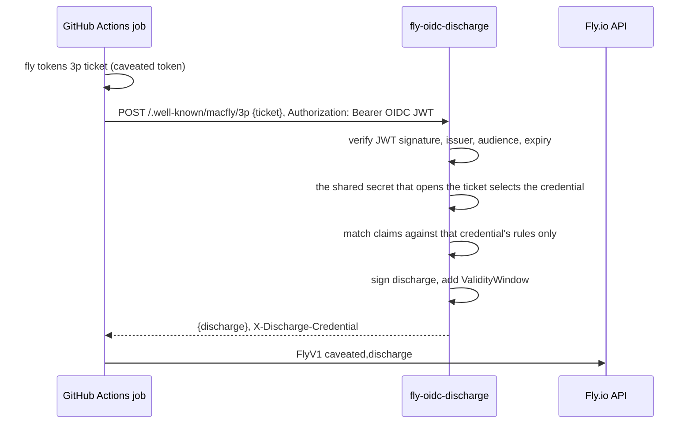

# fly-oidc-discharge

A service that mints short-lived Fly.io API tokens inside GitHub Actions
based on OIDC Connect. No (finished) Fly token need to be stored in GitHub secrets.

The problem:

OIDC is a popular form to deploy and authenticate from Github Actions.
[OpenID Connect](https://docs.github.com/en/actions/concepts/security/openid-connect)
lets you scope permissions for a CI workflow so it doesnt need to store
any long-lived credentials to access cloud providers.
Sadly, this isn't supported for fly.io.

The solution:

fly.io implements 'macaroons', a form of 'cryptographic/password capabilities'. This service bridges OIDC and Macaroons:
In fly.io terminology, it means each Fly token gets a [third-party caveat](https://fly.io/blog/macaroons-escalated-quickly/)
pointing at this service, which leaves the token inert until the service adds a discharge.
This service only adds a discharge after it validates the GitHub OIDC token
and makes sure the JWT matches the policy shipped with the service.
`fly deploy`, `fly secrets set`, and the rest work unchanged after the service added the discharge.



| What leaks | What the attacker gains |
|---|---|
| Caveated token (GitHub secret) | nothing without a discharge |
| Discharged token (compromised CI step) | that one environment, until the window ends |
| One shared secret (this service) | nothing without the matching caveated token |
| A caveated token and its shared secret | the full access of that one Fly token |

## Run it

This code consists of a web service, and a [github action](#wire-up-a-repository).
You can launch the service using the published image on fly.io.
You'll have to [write your own policy](#admission-policy) and deploy it alongside the service.
The admission policy describes which github actions will be allowed to discharge fly.io tokens.

To configure and deploy the service, we need to prepare two files:

- the admission `policy.yaml` ([example](./policy.example.yaml))
- and a `fly.toml` that carries the app name, the `[env]` block, and the `[[files]]` entry that maps the policy into the machine. Examples in this repository should work with minor modifications we describe next ([example](./fly.toml))

```bash
git clone https://github.com/gz/fly-oidc-discharge && cd fly-oidc-discharge
cp policy.example.yaml policy.yaml   # then edit it
$EDITOR fly.toml                     # app name, region, OIDC_DISCHARGE_LOCATION
fly launch --flycast --no-deploy --copy-config   # private app, no public IP, keeps this fly.toml
fly secrets set TLS_CERT="$(cat fullchain.pem)" TLS_PRIVATE_KEY="$(cat privkey.pem)"
fly secrets set SHARED_SECRET_PROD="$(cat PROD.secret)"
fly deploy --image ghcr.io/gz/fly-oidc-discharge:v1
```

`fly.toml` ships the policy in the `[[files]]` section.
Set `OIDC_DISCHARGE_LOCATION` to the URL the runner will use, which must match the caveat
location exactly.

### Reaching it

The default service config does not use a public IP.
The caller must be inside the Fly organization's private network.

| Deployment | Reachable by |
|---|---|
| Flycast, no public IP (default) | self-hosted runners in the org, or runners joined to a WireGuard or Tailscale path into the private network |
| Public IP | any runner, including GitHub-hosted |

For GitHub-hosted runners with no VPN, give the app a public address instead:

```bash
fly ips allocate-v4 --shared
fly ips allocate-v6
```

A public deployment should be safe as long as your policy is properly scoped.

### TLS

Fly Proxy cannot terminate TLS on a private address, because
[Flycast is HTTP-only](https://fly.io/docs/networking/flycast/). So the private deployment either
carries the certificate in the service or runs unencrypted, and the default carries it.

| Deployment | Who terminates TLS | Location |
|---|---|---|
| Flycast, private (default) | this service, from `TLS_CERT` | `https://<a name you control>` |
| Public IP | Fly, with a certificate it issues and renews | `https://<app>.fly.dev` |
| Flycast with no certificate | nobody, plain HTTP inside Fly's private network | `http://<app>.flycast` |

In the default, `fly.toml` forwards TCP on 443 with no `tls` handler and the service presents the
certificate from `TLS_CERT` and `TLS_PRIVATE_KEY`, which hold PEM content. Requests still go
through Fly Proxy, which is what starts a stopped machine.
Needs a DNS name you control, because a Flycast name cannot be certified.

Going public is simpler: leave `TLS_CERT` unset, use the `[http_service]` block commented in
`fly.toml`, and fly.io terminates TLS for `<app>.fly.dev` or for a domain you add with `fly certs add`.

## Wire up a repository

To configure the repository that connects to fly.io to deploy your app:

1. Generate one secret per credential and give them to the service.

   ```bash
   for env in PROD STAGING; do openssl rand -base64 32 > "$env.secret"; done
   fly secrets set \
     SHARED_SECRET_PROD="$(cat PROD.secret)" \
     SHARED_SECRET_STAGING="$(cat STAGING.secret)"
   ```

2. Mint one caveated token (e.g., one per environment).
   Use the same location string everywhere, no trailing slash, and the secret belonging to that environment.

   ```bash
   fly tokens create deploy --app my-app-prod --expiry 9999h > prod.tok
   fly tokens 3p add --location https://discharge.example.com \
       --secret-file PROD.secret --access-token "$(cat prod.tok)"
   ```

   Best practices: Store the printed `FlyV1 fm2_...` token as a GitHub **environment** secret of the matching
   environment, so only jobs targeting that environment can read it.
   Delete `*.tok`: the caveated token should be the only copy.
   Delete `*.secret`: The secret is only needed by the discharge service after tokens are minted.
   If you intend to re-mint new caveat tokens with the same secret, store it in a safe place.

4. Add the credential and its rules to `policy.yaml`, then `fly deploy`.

5. Use it in an actions workflow job.

   ```yaml
   jobs:
     deploy:
       environment: prod
       permissions:
         id-token: write
       steps:
         - uses: superfly/flyctl-actions/setup-flyctl@master
         - id: fly
           uses: gz/fly-oidc-discharge@v1.0.1
           with:
             caveated-token: ${{ secrets.FLY_CAVEATED_TOKEN }}
             location: https://discharge.example.com
         - run: flyctl deploy
           env:
             FLY_API_TOKEN: ${{ steps.fly.outputs.token }}
   ```

   The refs above are mutable for readability. It's best practice to pin
   every action to a commit SHA.

## Admission Policy

A credential is one Fly token, identified by the shared secret its caveat was sealed with.
The shared secrets are attached to the rules defined in the policy file that need to match in the JWT
that is supplied by the github actions job.
Two credentials sharing a secret will be rejected at startup but you can define multiple rules
per secret/credential.

```yaml
default_discharge_ttl: 15m

credentials:
  - name: prod
    shared_secret_env: SHARED_SECRET_PROD
    discharge_ttl: 10m
    rules:
      - name: prod deploy
        claims:
          repository: acme/web
          job_workflow_ref: acme/web/.github/workflows/deploy.yml@refs/heads/main
          environment: prod

  - name: staging
    shared_secret_env: SHARED_SECRET_STAGING
    rules:
      - name: staging deploy
        claims:
          repository: acme/web
          job_workflow_ref: acme/web/.github/workflows/deploy.yml@refs/heads/main
          environment: staging
```

A job is allowed when every claim of one rule of its credential matches. `*` matches any run of
characters, including `/`. Every rule must pin `repository`, `repository_owner`, `sub`, or
`job_workflow_ref`. Claim names follow the
[GitHub OIDC token](https://docs.github.com/en/actions/security-for-github-actions/security-hardening-your-deployments/about-security-hardening-with-openid-connect#understanding-the-oidc-token);
booleans such as `ref_protected` match as `"true"` or `"false"`.

Each credential names its own secret variable in the policy, through `shared_secret_env` or
`shared_secret_file`. Discharge lifetime comes from `default_discharge_ttl` and the optional
per-credential `discharge_ttl`.

## Configuration

| Variable | Default | Meaning |
|---|---|---|
| `OIDC_DISCHARGE_LOCATION` | required | URL given to `fly tokens 3p add --location` |
| `POLICY_FILE` | `/etc/fly-oidc-discharge/policy.yaml` | policy location |
| `POLICY_YAML` | | policy as inline YAML; takes precedence over `POLICY_FILE` |
| `OIDC_ISSUER` | `https://token.actions.githubusercontent.com` | OIDC issuer to trust |
| `OIDC_AUDIENCE` | `OIDC_DISCHARGE_LOCATION` | `aud` the job must request |
| `LISTEN_ADDR` | `:8080` | listen address |
| `TLS_CERT` | | certificate chain in PEM, or `TLS_CERT_FILE` naming a file |
| `TLS_PRIVATE_KEY` | | private key in PEM, or `TLS_PRIVATE_KEY_FILE` naming a file |
